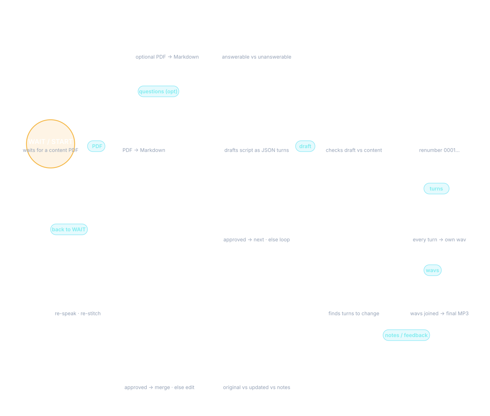

# InkAudio

Drop a PDF. Get a podcast. Two AI hosts debate your document, sound natural, and produce a finished MP3.

InkAudio is a local, CLI-first pipeline that turns any PDF into a two-host podcast episode. A LangGraph actor-critic loop iteratively refines the script, voices are synthesized per turn, and every segment is stitched into a single audio file.



---

## Quickstart

```bash
pip install -r requirements.txt
cp .env.example .env           # add GEMINI_API_KEY
python models/download_models.py  # fetch Qwen3-TTS checkpoints
python -m src.pipeline --pdf Content/input.pdf
```

That's it. The pipeline runs end-to-end: ingest → script → TTS → stitch → `Audio/final_podcast.mp3`.

---

## How It Works

The pipeline has four stages and one feedback loop:

| Stage | What happens |
|-------|-------------|
| **Ingest** | PDF → Markdown (via docling). Also optionally parses a questions PDF. |
| **Script** | A LangGraph `StateGraph` runs Actor → Critic → Router. The Actor drafts turns as JSON, the Critic checks them against the source, and the Router loops back with feedback until approved (max 3 rounds). Answerable questions from the questions PDF are injected as context. |
| **TTS** | Each turn is synthesized to its own WAV — Bodhan API for multilingual, Qwen3-TTS for English (custom voice or voice design modes). |
| **Stitch** | All WAVs are concatenated with configurable silence gaps into `final_podcast.mp3`. |

**Revision flow:** After generation, write feedback notes to `Content/feedback.txt` and re-run with `--revise`. An Editor identifies which turns to change, a Critic validates the edits against your notes, and only the changed turns are re-synthesized and re-stitched.

---

## Usage

```
python -m src.pipeline [options]
```

| Flag | Default | Description |
|------|---------|-------------|
| `--pdf <path>` | From `config.yaml` | Input content PDF |
| `--skip-ingest` | off | Skip PDF → Markdown conversion |
| `--skip-script` | off | Skip script generation (re-TTS existing script) |
| `--skip-stitch` | off | Skip final MP3 stitching |
| `--no-tts` | off | Skip TTS entirely (script only) |
| `--force-ingest` | off | Re-convert PDF even if Markdown exists |
| `--revise` | off | Run revision loop from `Content/feedback.txt` |
| `--feedback <path>` | `Content/feedback.txt` | Custom feedback file for `--revise` |
| `--config <path>` | `config.yaml` | Custom config file |

---

## Configuration

- **`config.yaml`** — All non-secret settings: LLM endpoints, TTS mode, voice config, pipeline parameters.
- **`.env`** — API keys (`GEMINI_API_KEY` for both actor and critic LLMs, `BODHAN_TTS` for Bodhan TTS).
- **`src/tts_requirements/*.yaml`** — Per-mode voice templates (`bodhan.yaml`, `custom_voice.yaml`, `voice_design.yaml`).

### TTS Modes

Set `tts.mode` in `config.yaml`:

- **`bodhan`** — Cloud API, 45+ Indian voices. Each host gets a voice name from the template.
- **`custom_voice`** — Local Qwen3-TTS 1.7B (4-bit quantized), 9 preset speakers with style instructions.
- **`voice_design`** — Local Qwen3-TTS 1.7B, natural-language voice descriptions per host.

---

## Project Structure

```
Content/          # Input PDFs, generated Markdown, script.json, LLM logs
Audio/            # Per-turn WAVs and final_podcast.mp3
models/           # Local Qwen3-TTS checkpoints (download via models/download_models.py)
src/              # Pipeline modules (see src/README.md)
docs/             # Flowchart and design docs
web/              # Web UI (HTML/CSS/JS)
```

---

## Revision

```bash
# After a generation, write feedback
echo "Make host 2 more energetic in turns 3-5" > Content/feedback.txt

# Re-run with revision
python -m src.pipeline --revise

# Or use a different feedback file
python -m src.pipeline --revise --feedback my_notes.txt
```

The revision graph (Editor → Critic → Router) compares original vs updated script against your notes, loops until approved, then re-synthesizes only the changed turns and re-stitches.

---

## Tests

```bash
~/.local/bin/pytest tests/ -q   # 61 tests, mocked LLM/TTS
```

---

## Requirements

- Python 3.10+
- CUDA-capable GPU recommended for local Qwen3-TTS (falls back to CPU)
- `GEMINI_API_KEY` for LLM calls
- `BODHAN_TTS` API key if using Bodhan mode
