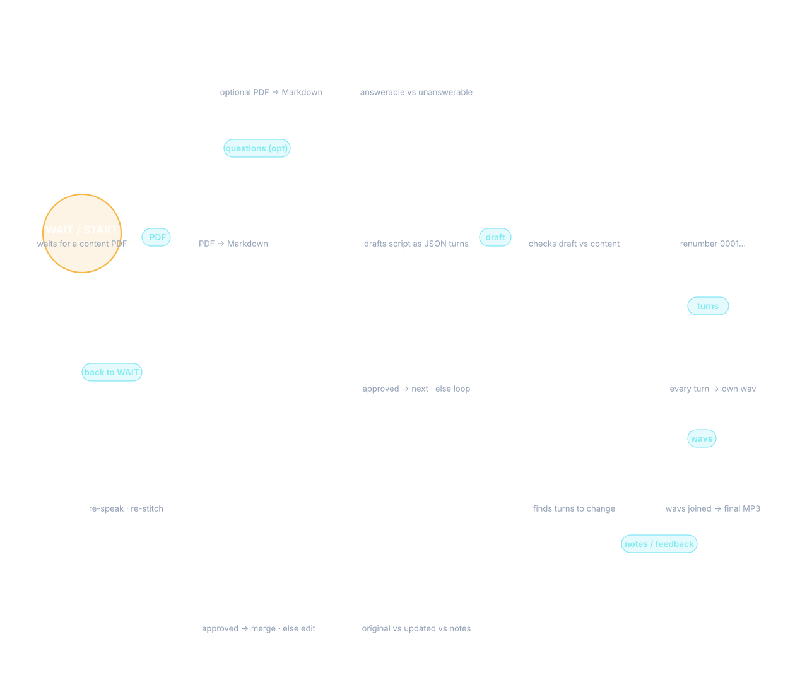

# InkAudio

Drop a PDF. Get a podcast. Two AI hosts debate your document, sound natural, and produce a finished MP3.

InkAudio is a local, CLI-first pipeline that turns any PDF into a two-host podcast episode. A LangGraph actor-critic loop iteratively refines the script, voices are synthesized per turn, and every segment is stitched into a single audio file.



---

## Quickstart

```bash
pip install -r requirements.txt
cp .env.example .env           # add GEMINI_API_KEY
python models/download_models.py  # fetch Qwen3-TTS checkpoints
python -m src.pipeline --pdf Content/input.pdf
```

That's it. The pipeline runs end-to-end: ingest → script → TTS → stitch → `Audio/final_podcast.mp3`.

---

## How It Works

The pipeline has five stages (translation is optional) and one feedback loop:

| Stage | What happens |
|-------|-------------|
| **Ingest** | PDF → Markdown (via docling). Also optionally parses a questions PDF. |
| **Script** | A LangGraph `StateGraph` runs Actor → Critic → Router. The Actor drafts turns as JSON, the Critic checks them against the source, and the Router loops back with feedback until approved (max 3 rounds). Answerable questions from the questions PDF are injected as context. |
| **Translate** | For Indic Bodhan podcasts, translate the full English conversation into native-script code-mixed dialogue. Fall back to consecutive dialogue blocks if necessary. |
| **TTS** | Each turn is synthesized to its own WAV — Bodhan API for multilingual, Qwen3-TTS for English (custom voice or voice design modes). Longer Bodhan turns are synthesized in short chunks and combined into one turn WAV. |
| **Stitch** | All WAVs are concatenated with configurable silence gaps into `final_podcast.mp3`. |

**Revision flow:** After generation, write feedback notes to `Content/feedback.txt` and re-run with `--revise`. An Editor identifies which turns to change, a Critic validates the edits against your notes, and only the changed turns are re-synthesized and re-stitched.

---

## Usage

```
python -m src.pipeline [options]
```

| Flag | Default | Description |
|------|---------|-------------|
| `--pdf <path>` | From `config.yaml` | Input content PDF |
| `--skip-ingest` | off | Skip PDF → Markdown conversion |
| `--skip-script` | off | Skip script generation (re-TTS existing script) |
| `--skip-stitch` | off | Skip final MP3 stitching |
| `--no-tts` | off | Skip TTS entirely (script only) |
| `--force-ingest` | off | Re-convert PDF even if Markdown exists |
| `--revise` | off | Run revision loop from `Content/feedback.txt` |
| `--feedback <path>` | `Content/feedback.txt` | Custom feedback file for `--revise` |
| `--config <path>` | `config.yaml` | Custom config file |
| `--language <code>` | `tts.podcast_language` (`en`) | Whole-podcast language, Bodhan only (e.g. `hi`, `ta`) |

---

## Configuration

- **`config.yaml`** — All non-secret settings: LLM endpoints, TTS mode, voice config, pipeline parameters.
- **`.env`** — API keys (`GEMINI_API_KEY` for both actor and critic LLMs, `BODHAN_TTS` for Bodhan TTS, and a separate `BODHAN_TRANSLATION` key for Indic translation).
- **`src/tts_requirements/*.yaml`** — Per-mode voice templates (`bodhan.yaml`, `custom_voice.yaml`, `voice_design.yaml`).

### TTS Modes

Set `tts.mode` in `config.yaml`:

- **`bodhan`** — Cloud API, 45+ Indian voices. Each host gets a voice name from the template.
- **`custom_voice`** — Local Qwen3-TTS 1.7B (4-bit quantized), 9 preset speakers with style instructions.
- **`voice_design`** — Local Qwen3-TTS 1.7B, natural-language voice descriptions per host.

### Indic podcasts with Bodhan

Set `tts.mode: bodhan` and `tts.podcast_language: hi` (or another supported
code), or override the language on the CLI:

```bash
python -m src.pipeline --pdf Content/input.pdf --language hi
python -m src.pipeline --revise --language hi
```

Both hosts use the selected language with natural English mixing, while keeping
their individual voices. Hindi produces Hindi-English dialogue; Tamil produces
Tamil-English dialogue. The language is independent of the voice's recording
language. Per-host `lang` settings in the Bodhan template are superseded by the
podcast language; conflicting API host overrides are rejected.

Supported codes: `en`, `as`, `bn`, `brx`, `doi`, `gu`, `hi`, `kn`, `kok`, `ks`,
`mai`, `ml`, `mni`, `mr`, `ne`, `or`, `pa`, `sa`, `sat`, `sd`, `ta`, `te`, `ur`.
Alternate-script codes and Romanized output are not exposed.

English bypasses translation. Other languages send the entire numbered dialogue
to Bodhan `/v1/chat/completions` with `model: indic-translate` and
`target_script: codemix`; IDs and order are validated before
publishing. Oversized, truncated or misaligned responses fall back to smaller
consecutive dialogue blocks. A failure at single-turn size stops the job. No
transliteration or extra LLM polishing pass is used.

`Content/script_english.json` retains the editable English source;
`Content/script.json` contains the spoken dialogue, and `script_metadata.json`
records its language. Revisions edit English and translate only the changed turns;
unchanged turns retain their existing spoken text and audio. Both scripts are saved
before TTS, which overwrites only changed spoken turns in the current audio directory
and then re-stitches the podcast. If Bodhan synthesis fails, the scripts and completed
WAV replacements remain saved, the error is reported, and stitching does not run.
Use `python -m src.pipeline --skip-ingest --skip-script` to rebuild audio from the
saved script after a failure.
Keep the same language when revising or regenerating
audio. `--no-tts` still produces the translated spoken script.

The website exposes one language selector in Bodhan mode. Selecting a language
chooses its native male/female voices for Host 1/Host 2; both dropdowns still
offer all voices, labeled by recording language. Manual choices survive TTS mode
switches and reset when the language changes. English uses the template voices.
API clients pass
`podcast_language` in the existing multipart JSON `config` field:

```bash
curl -F 'content_pdf=@Content/input.pdf' \
  -F 'config={"podcast_language":"ta","host1":{"voice":"Parth"},"host2":{"voice":"Suhani"}}' \
  http://localhost:8000/api/job/bodhan
```

`GET /api/tts/languages` returns available codes/names and the configured default.
The script endpoint and result page use spoken text; status/results include
`podcast_language`. SSE emits the `translation` stage and `translation_progress`
with completed/total turns. API script files live only in `.api_tmp/` and follow
the existing job cleanup lifecycle.

Status includes the current `stage`, `progress`, and `cancel_requested`; SSE sends
a `snapshot` when connecting and when the job ends. Terminate (or finish during
generation) returns `cancelling`: the current operation must stop before files
are removed and another job can start. Failed/terminated status remains available
until finish or the next job, so refreshing preserves the error. Website generation
fails if any turn cannot be synthesized, returns empty audio, or cannot be stitched.

Credentials remain in `.env`. Override their environment variable names using
`tts.bodhan_api_key_env` and `tts.bodhan_translation_api_key_env`. Requests use
bounded retries, provider rate-limit headers and cancellation-aware waits. A
failed Bodhan synthesis stops the job rather than silently dropping dialogue.
Conversational translation/pronunciation quality still needs native-speaker
listening review; mocked tests verify pipeline behavior only.

---

## Project Structure

```
Content/          # Input PDFs, generated Markdown, script.json, LLM logs
Audio/            # Per-turn WAVs and final_podcast.mp3
models/           # Local Qwen3-TTS checkpoints (download via models/download_models.py)
src/              # Pipeline modules (see src/README.md)
docs/             # Flowchart and design docs
web/              # Web UI (HTML/CSS/JS)
```

---

## Revision

```bash
# After a generation, write feedback
echo "Make host 2 more energetic in turns 3-5" > Content/feedback.txt

# Re-run with revision
python -m src.pipeline --revise

# Or use a different feedback file
python -m src.pipeline --revise --feedback my_notes.txt
```

The revision graph (Editor → Critic → Router) compares original vs updated script against your notes, loops until approved, then re-synthesizes only the changed turns and re-stitches.

---

## Tests

```bash
~/.local/bin/pytest tests/ -q   # mocked LLM/translation/TTS
```

---

## Requirements

- Python 3.10+
- CUDA-capable GPU recommended for local Qwen3-TTS (falls back to CPU)
- `GEMINI_API_KEY` for LLM calls
- `BODHAN_TTS` API key if using Bodhan mode
- `BODHAN_TRANSLATION` API key if selecting an Indic podcast language
